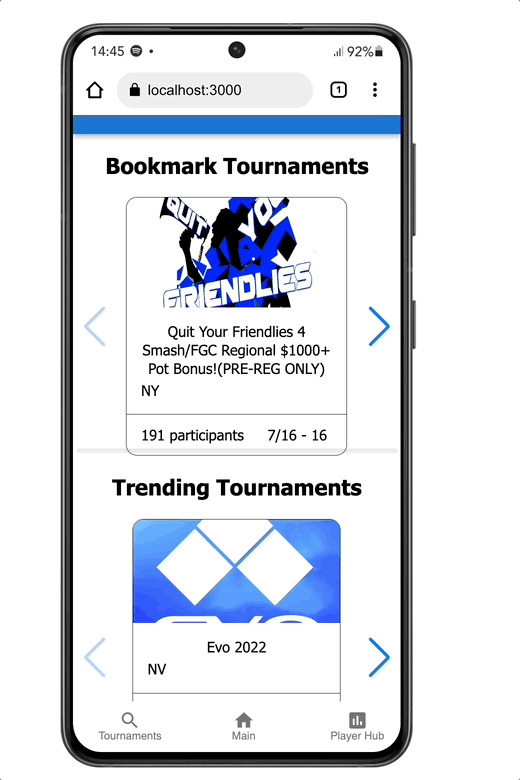

(View Raw will give you the markdown that you can copy to your repos!)

# Crush Counter

## Description

_Duration: 2 Week Sprint_

This app aims to provide data to intermediate to advanced Esport fighting game players to help improve their game. Users can search for tournaments to compete in; create, review, and edit match notes; and show the user's win rate, fighting game skills they are doing well, and areas of opportunity.

To see the fully functional site, please visit: Comming Soon

## Screen Shot

## Installation

If your application has secret keys (for example --  Twilio), make sure you tell them how to set that up, both in getting the key and then what to call it in the `.env` file.

1. Create a database named `crush-counter-database`,
2. The queries in the `database.sql` file are set up to create all the necessary tables and populate the needed data to allow the application to run correctly. The project is built on [Postgres](https://www.postgresql.org/download/), so you will need to make sure to have that installed. We recommend using Postico to run those queries as that was used to create the queries, 
3. Open up your editor of choice and run an `npm install`
4. Run `npm run server` in your terminal
5. Run `npm run client` in your terminal
6. The `npm run client` command will open up a new browser tab for you!

## Usage
How does someone use this application? Tell a user story here.

## Built With

- JavaScript
- ExpressJS
- NodeJS
- Redux
- Redux-Saga
- Postgres
- Start.gg API
- Passport

## License
[MIT](https://choosealicense.com/licenses/mit/)

_Note, include this only if you have a license file. GitHub will generate one for you if you want!_

## Acknowledgement
Thanks to [Prime Digital Academy](www.primeacademy.io) who equipped and helped me to make this application a reality. (Thank your people)

## Support
If you have suggestions or issues, please email me at [youremail@whatever.com](www.google.com)
